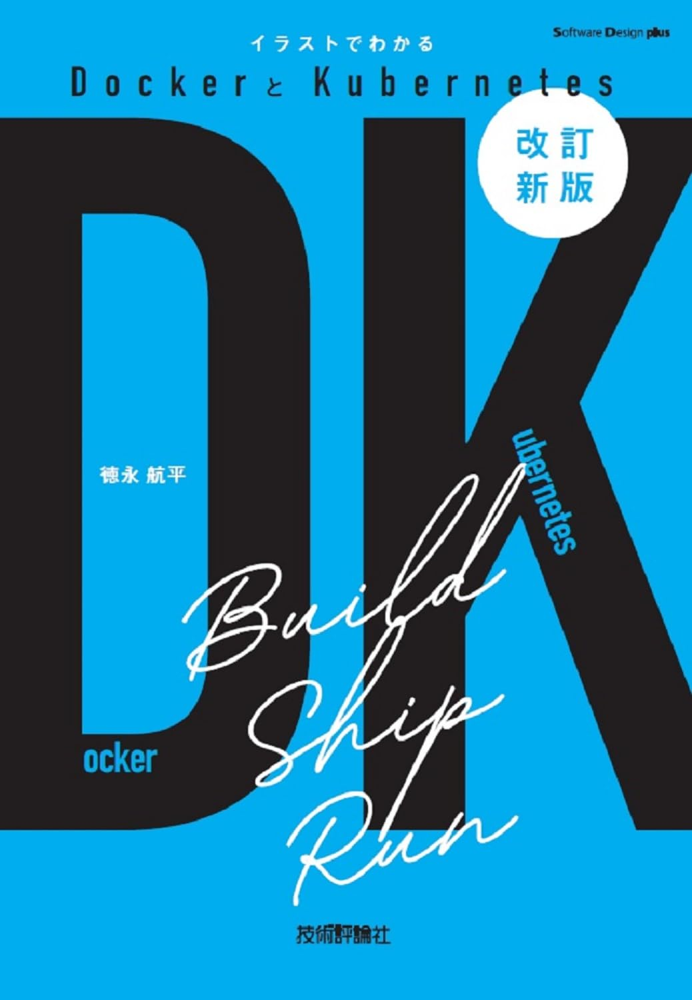

# はじめに
この技術記事は［改訂新版］イラストでわかるDockerとKubernetes の要約記事です。
私自身、高卒かつ数学偏差値48であるため、そのような初心者の方でもわかりやすいようにまとめました。

## 対象者
- DockerとKubernetesの初心者向けの記事を読みたい人
- DockerとKubernetesの概要をサラっと図解で学習したい人
- DockerとKubernetesのことを学習したいけど、コンピュータサイエンスが全くわからない人

## この記事のゴール
実際に実行されるコマンドや図解を通してDockerとKubernetesの概要を"なんとなく"理解する。

## 参考書籍
[［改訂新版］イラストでわかるDockerとKubernetes](https://www.amazon.co.jp/%EF%BC%BB%E6%94%B9%E8%A8%82%E6%96%B0%E7%89%88%EF%BC%BD%E3%82%A4%E3%83%A9%E3%82%B9%E3%83%88%E3%81%A7%E3%82%8F%E3%81%8B%E3%82%8BDocker%E3%81%A8Kubernetes-Software-Design-plus%E3%82%B7%E3%83%AA%E3%83%BC%E3%82%BA-%E5%BE%B3%E6%B0%B8/dp/4297140551/ref=sr_1_1?__mk_ja_JP=%E3%82%AB%E3%82%BF%E3%82%AB%E3%83%8A&dib=eyJ2IjoiMSJ9.yt5-kx7_-h-ADLap_tbKFo3wdAb9UuWm8Q84w1XUWd-rwLWlYz5fJEDpc9a2kjT-lJJa8GZwMYtaZbHCMKx_dAe-48zh4yhinp7qSPpoFo1Nrfv2wcmOmKxFT8mjfZh0qkKWCRn34P00ftUFRGQIoMwHTlmr_W32A24Fazck_Hjii1CSagQE6Ie5puOx9z7n1A_vK-rsOgEdgjWDV9uayWnfKKlBaqw4U4eiuJTtp6L8BmEfg7tKdsQDHc1oxO93IbUyzhLTDByMlGu0TeWmr6D4GIpMs6MjmjoDL1TzsyE.yzmw96bYRqbSFAFYvZAYFTSFwOsXMC5b3I17Dh0jR10&dib_tag=se&keywords=%E3%82%A4%E3%83%A9%E3%82%B9%E3%83%88%E3%81%A7%E3%82%8F%E3%81%8B%E3%82%8BDocker%E3%81%A8Kubernetes&qid=1764036366&sr=8-1)

